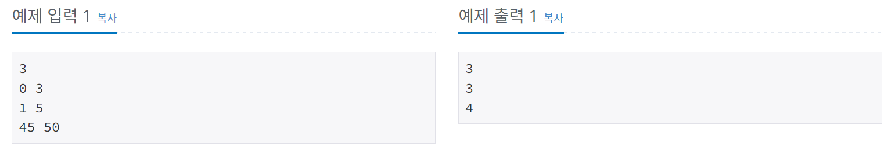
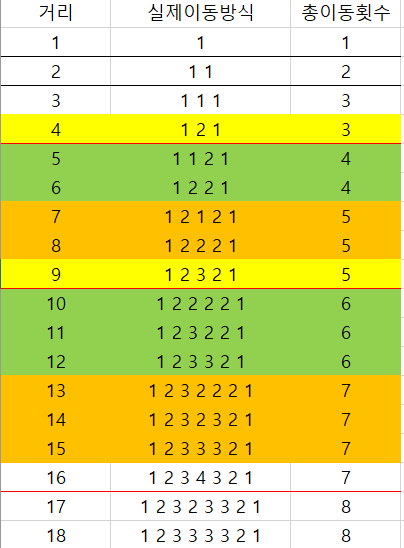

# Fly me to the Alpha Centauri
[문제링크](https://www.acmicpc.net/problem/1011)

## 1. 문제 설명

### 1.1 문제요약
- 이 공간이동 장치는 이동 거리를 급격하게 늘릴 경우 기계에 심각한 결함이 발생하는 단점이 있어서, 이전 작동시기에 k광년을 이동하였을 때는 k-1 , k 혹은 k+1 광년만을 다시 이동할 수 있다. 예를 들어, 이 장치를 처음 작동시킬 경우 -1 , 0 , 1 광년을 이론상 이동할 수 있으나 사실상 음수 혹은 0 거리만큼의 이동은 의미가 없으므로 1 광년을 이동할 수 있으며, 그 다음에는 0 , 1 , 2 광년을 이동할 수 있는 것이다. ( 여기서 다시 2광년을 이동한다면 다음 시기엔 1, 2, 3 광년을 이동할 수 있다. )

- 공간이동 장치를 이용해 x지점에서 y지점을 향해 최소한의 작동 횟수로 이동하려 한다. 하지만 y지점에 도착해서도 공간 이동장치의 안전성을 위하여 y지점에 도착하기 바로 직전의 이동거리는 반드시 1광년으로 하려 한다.

- x지점부터 정확히 y지점으로 이동하는데 필요한 공간 이동 장치 작동 횟수의 최솟값을 구하는 프로그램을 작성하라.

### 1.2 입출력 방식 
- 입력의 첫 줄에는 테스트케이스의 개수 T가 주어진다. 각각의 테스트 케이스에 대해 현재 위치 x 와 목표 위치 y 가 정수로 주어지며, x는 항상 y보다 작은 값을 갖는다. (0 ≤ x < y < 2**31)
- 각 테스트 케이스에 대해 x지점으로부터 y지점까지 정확히 도달하는데 필요한 최소한의 공간이동 장치 작동 횟수를 출력한다.
### 1.3 입출력 예시

## 2. 문제해결 아이디어

### 2.1 BFS같은 알고리즘으로 접근하면 안된다.
- 2**31 로 입력이 들어오기때문에 BFS로 풀면 시간 복잡도가 터질것이 분명하다.
- 일단 막막해서 규칙찾기에 돌입한다.

### 2.2 계속해서 나열하면서 규칙을 찾는다.

- 제곱수, 제곱수+n, 제곱수+n과 다음 제곱수의 사이를 기점으로 규칙이 있다는 것을 알 수 있다.

### 2.3 규칙대로 구현한다.
- 제곱근해서 버린거*2 -1, 제곱근해서 버린거*2 , 제곱근해서 버린거*2 +1 세가지 출력을 케이스를 나눠서 해준다.