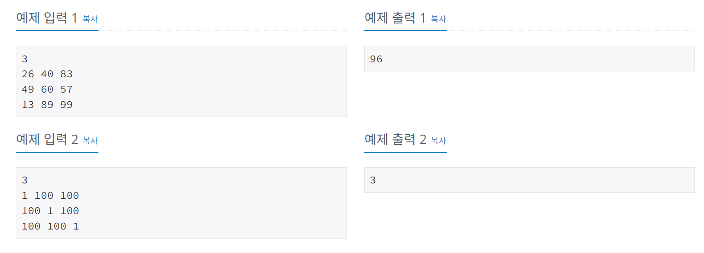

# RGB거리
[문제링크](https://www.acmicpc.net/problem/1149)

## 1. 문제 설명

### 1.1 문제요약
- RGB거리에는 집이 N개 있다. 거리는 선분으로 나타낼 수 있고, 1번 집부터 N번 집이 순서대로 있다.

- 집은 빨강, 초록, 파랑 중 하나의 색으로 칠해야 한다. 각각의 집을 빨강, 초록, 파랑으로 칠하는 비용이 주어졌을 때, 아래 규칙을 만족하면서 모든 집을 칠하는 비용의 최솟값을 구해보자.

1. 1번 집의 색은 2번 집의 색과 같지 않아야 한다.
2. N번 집의 색은 N-1번 집의 색과 같지 않아야 한다.
3. i(2 ≤ i ≤ N-1)번 집의 색은 i-1번, i+1번 집의 색과 같지 않아야 한다.

### 1.2 입출력 방식 
1. 입력
- 첫째 줄에 집의 수 N(2 ≤ N ≤ 1,000)이 주어진다. 둘째 줄부터 N개의 줄에는 각 집을 빨강, 초록, 파랑으로 칠하는 비용이 1번 집부터 한 줄에 하나씩 주어진다. 집을 칠하는 비용은 1,000보다 작거나 같은 자연수이다.

2. 출력
- 첫째 줄에 모든 집을 칠하는 비용의 최솟값을 출력한다.

### 1.3 입출력 예시

## 2. 문제해결 아이디어

### 2.1 모든 경우의수를 다 계산해서 dp 테이블을 만들고 min값을 출력한다.
- 첫번째가 빨강일때는 뒤에 초록이거나 파랑일경우중 min값을 더해준다.
- 첫번째가 초록일때는 뒤에 빨강이거나 파랑일경우중 min값을 더해준다.
- 첫번째가 파랑일때는 뒤에 빨강이거나 초록일경우중 min값을 더해준다.
- 이런식으로 모든 경우의수를 계산해준다.   