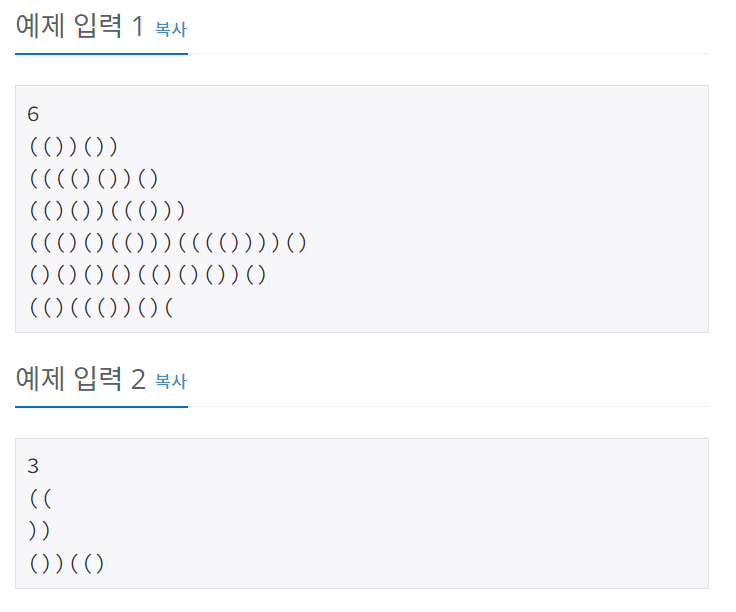
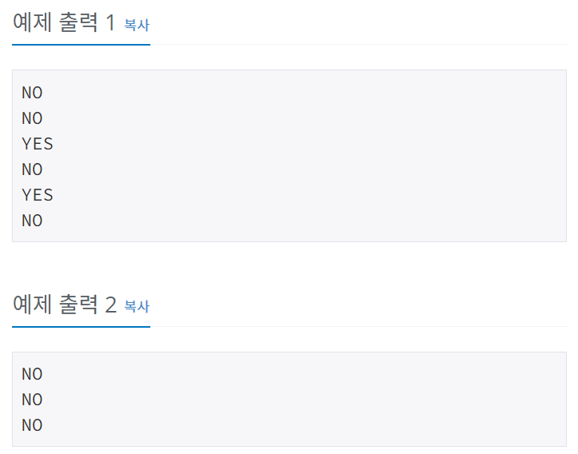

# 괄호
[문제링크](https://www.acmicpc.net/problem/9012)

## 1. 문제 설명

### 1.1 문제요약
- 괄호 문자열(Parenthesis String, PS)은 두 개의 괄호 기호인 ‘(’ 와 ‘)’ 만으로 구성되어 있는 문자열이다. 그 중에서 괄호의 모양이 바르게 구성된 문자열을 올바른 괄호 문자열(Valid PS, VPS)이라고 부른다. 한 쌍의 괄호 기호로 된 “( )” 문자열은 기본 VPS 이라고 부른다. 만일 x 가 VPS 라면 이것을 하나의 괄호에 넣은 새로운 문자열 “(x)”도 VPS 가 된다. 그리고 두 VPS x 와 y를 접합(concatenation)시킨 새로운 문자열 xy도 VPS 가 된다. 예를 들어 “(())()”와 “((()))” 는 VPS 이지만 “(()(”, “(())()))” , 그리고 “(()” 는 모두 VPS 가 아닌 문자열이다. 

- 여러분은 입력으로 주어진 괄호 문자열이 VPS 인지 아닌지를 판단해서 그 결과를 YES 와 NO 로 나타내어야 한다. 

### 1.2 입출력 방식 
- 입력 데이터는 표준 입력을 사용한다. 입력은 T개의 테스트 데이터로 주어진다. 입력의 첫 번째 줄에는 입력 데이터의 수를 나타내는 정수 T가 주어진다. 각 테스트 데이터의 첫째 줄에는 괄호 문자열이 한 줄에 주어진다. 하나의 괄호 문자열의 길이는 2 이상 50 이하이다. 
- 출력은 표준 출력을 사용한다. 만일 입력 괄호 문자열이 올바른 괄호 문자열(VPS)이면 “YES”, 아니면 “NO”를 한 줄에 하나씩 차례대로 출력해야 한다. 
### 1.3 입출력 예시

## 2. 문제해결 아이디어

### 2.1 괄호가 정상적으로 열리고 닫히는지(짝이 맞는지) 검사한다.
- '('이 들어올 때는 그냥 스택에 append한다.
- ')'이 들어올 때는 스택에 append하고 '()' 쌍을 맞춰서 스택에서 뺀다. 만약, 앞에 '(' 이 없어서 쌍이 안맞으면 break를 걸어서 for문을 중지시킨다.
- 위의 두 과정을 진행했을 때 스택에 원소가 남아있으면 VPS가 아니고, 스택에 원소가 남아있지 않으면 VPS 이다.
- 파이썬에서 스택은 리스트에서 append하고, pop하면 구현할 수 있다.