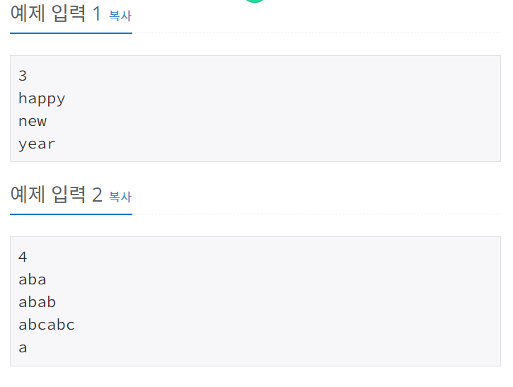
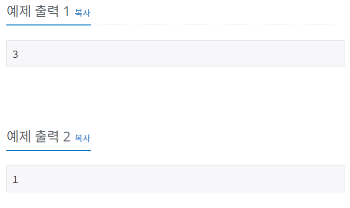

# 그룹단어체커
[문제링크](https://www.acmicpc.net/problem/1316)

## 1. 문제 설명

### 1.1 문제요약
- 그룹 단어란 단어에 존재하는 모든 문자에 대해서, 각 문자가 연속해서 나타나는 경우만을 말한다. 예를 들면, ccazzzzbb는 c, a, z, b가 모두 연속해서 나타나고, kin도 k, i, n이 연속해서 나타나기 때문에 그룹 단어이지만, aabbbccb는 b가 떨어져서 나타나기 때문에 그룹 단어가 아니다.

- 단어 N개를 입력으로 받아 그룹 단어의 개수를 출력하는 프로그램을 작성하시오.
### 1.2 입출력 방식 
- 첫째 줄에 단어의 개수 N이 들어온다. N은 100보다 작거나 같은 자연수이다. 둘째 줄부터 N개의 줄에 단어가 들어온다. 단어는 알파벳 소문자로만 되어있고 중복되지 않으며, 길이는 최대 100이다.
- 첫째 줄에 그룹 단어의 개수를 출력한다.
### 1.3 입출력 예시

## 2. 문제해결 아이디어

### 2.1 단어에서 문자열을 떼와서 하나씩 넣으면서 그룹단어 체크한다.

### 2.2 그룹단어 체크방법
- 단어의 첫글자는 체커(group_word)에 넣는다
- 두번째 글자부터 체커에 있는지 없는지 검사한다.
    - 체커에 있을 때 제일 최근에 체커에 들어온 글자와 같으면 그룹단어규칙을 깨지 않으므로 그냥 진행하고, 다른경우에는 그룹단어가 아니게 됨으로 break를 걸어준다.
- 위의 방식으로 단어를 검사한다.