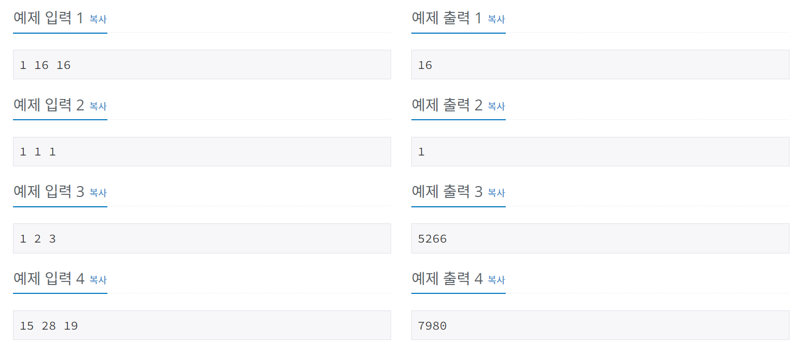

# 날짜계산
[문제링크](https://www.acmicpc.net/problem/1476)

## 1. 문제 설명

### 1.1 문제요약
- 준규가 사는 나라는 우리가 사용하는 연도와 다른 방식을 이용한다. 준규가 사는 나라에서는 수 3개를 이용해서 연도를 나타낸다. 각각의 수는 지구, 태양, 그리고 달을 나타낸다.

- 지구를 나타내는 수를 E, 태양을 나타내는 수를 S, 달을 나타내는 수를 M이라고 했을 때, 이 세 수는 서로 다른 범위를 가진다. (1 ≤ E ≤ 15, 1 ≤ S ≤ 28, 1 ≤ M ≤ 19)

- 우리가 알고있는 1년은 준규가 살고있는 나라에서는 1 1 1로 나타낼 수 있다. 1년이 지날 때마다, 세 수는 모두 1씩 증가한다. 만약, 어떤 수가 범위를 넘어가는 경우에는 1이 된다.

- 예를 들어, 15년은 15 15 15로 나타낼 수 있다. 하지만, 1년이 지나서 16년이 되면 16 16 16이 아니라 1 16 16이 된다. 이유는 1 ≤ E ≤ 15 라서 범위를 넘어가기 때문이다.

- E, S, M이 주어졌고, 1년이 준규가 사는 나라에서 1 1 1일때, 준규가 사는 나라에서 E S M이 우리가 알고 있는 연도로 몇 년인지 구하는 프로그램을 작성하시오.

### 1.2 입출력 방식 
- 첫째 줄에 세 수 E, S, M이 주어진다. 문제에 나와있는 범위를 지키는 입력만 주어진다.
- 첫째 줄에 E S M으로 표시되는 가장 빠른 연도를 출력한다. 1 1 1은 항상 1이기 때문에, 정답이 음수가 나오는 경우는 없다.

### 1.3 입출력 예시

## 2. 문제해결 아이디어

### 2.1 연도에서 e, s, m을 뺀것을 각각 주기로 나눈 나머지가 모두 0일때가 우리가 구해야하는 연도다.
- 15, 28, 19 의 주기로 e, s, m이 돌아간다.
- year-e, year-s, year-m을 각각 15, 28, 19로 나눴을 때 나머지가 모두 0일 때의 year를 출력한다.

