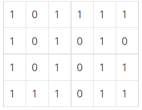
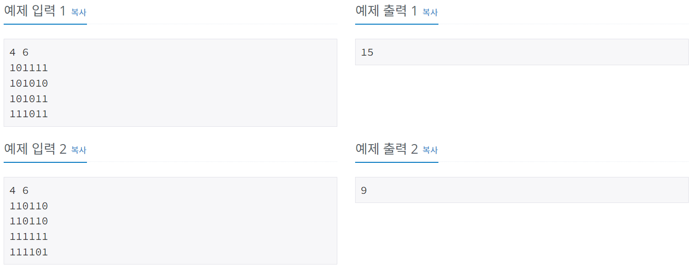

# 미로 탐색
[문제링크](https://www.acmicpc.net/problem/2178)

## 1. 문제 설명

### 1.1 문제요약
- N×M크기의 배열로 표현되는 미로가 있다.

- 미로에서 1은 이동할 수 있는 칸을 나타내고, 0은 이동할 수 없는 칸을 나타낸다. 이러한 미로가 주어졌을 때, (1, 1)에서 출발하여 (N, M)의 위치로 이동할 때 지나야 하는 최소의 칸 수를 구하는 프로그램을 작성하시오. 한 칸에서 다른 칸으로 이동할 때, 서로 인접한 칸으로만 이동할 수 있다.

- 위의 예에서는 15칸을 지나야 (N, M)의 위치로 이동할 수 있다. 칸을 셀 때에는 시작 위치와 도착 위치도 포함한다.

### 1.2 입출력 방식 
- 첫째 줄에 두 정수 N, M(2 ≤ N, M ≤ 100)이 주어진다. 다음 N개의 줄에는 M개의 정수로 미로가 주어진다. 각각의 수들은 붙어서 입력으로 주어진다.
- 첫째 줄에 지나야 하는 최소의 칸 수를 출력한다. 항상 도착위치로 이동할 수 있는 경우만 입력으로 주어진다.

### 1.3 입출력 예시

## 2. 문제해결 아이디어

### 2.1 BFS를 이용하여 풀이한다.
- 시작점에서 가까운 노드들 부터 차례대로 탐색한다.
