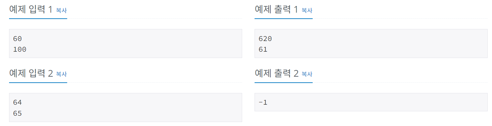

# 소수
[문제링크](https://www.acmicpc.net/problem/2581)

## 1. 문제 설명

### 1.1 문제요약
- 자연수 M과 N이 주어질 때 M이상 N이하의 자연수 중 소수인 것을 모두 골라 이들 소수의 합과 최솟값을 찾는 프로그램을 작성하시오.

- 예를 들어 M=60, N=100인 경우 60이상 100이하의 자연수 중 소수는 61, 67, 71, 73, 79, 83, 89, 97 총 8개가 있으므로, 이들 소수의 합은 620이고, 최솟값은 61이 된다.
### 1.2 입출력 방식 
- 입력의 첫째 줄에 M이, 둘째 줄에 N이 주어진다.

- M과 N은 10,000이하의 자연수이며, M은 N보다 작거나 같다.

- M이상 N이하의 자연수 중 소수인 것을 모두 찾아 첫째 줄에 그 합을, 둘째 줄에 그 중 최솟값을 출력한다. 

- 단, M이상 N이하의 자연수 중 소수가 없을 경우는 첫째 줄에 -1을 출력한다.
### 1.3 입출력 예시

## 2. 문제해결 아이디어

### 2.1 소수 걸러주는 알고리즘을 적용한다.
- x = 1일때는 False를 return 한다.
- x != 1 일때는 2부터 x까지 검사하면서 x를 나눌 수 있는 수가 존재하면(소수가아니면) False를 리턴, x를 나눌 수 있는 수가 존재하지 않으면(소수면) True를 리턴한다.
### 2.2 소수인 숫자들을 sum, min으로 합계와 최소값을 구해준다.
- 위의 알고리즘을 이용해서 리스트에 소수를 넣은 다음, sum과 min으로 출력한다.
- 이 때 만약 소수인 숫자가 없다면 리스트가 비어있는 경우이므로, -1을 출력한다.