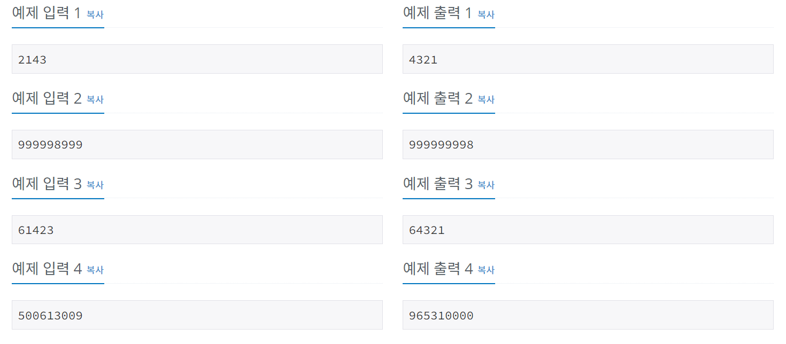

# 소트인사이드
[문제링크](https://www.acmicpc.net/problem/1427)

## 1. 문제 설명

### 1.1 문제요약
- 배열을 정렬하는 것은 쉽다. 수가 주어지면, 그 수의 각 자리수를 내림차순으로 정렬해보자.

### 1.2 입출력 방식 
- 첫째 줄에 정렬하려고 하는 수 N이 주어진다. N은 1,000,000,000보다 작거나 같은 자연수이다.

- 첫째 줄에 자리수를 내림차순으로 정렬한 수를 출력한다.
### 1.3 입출력 예시

## 2. 문제해결 아이디어

### 2.1 숫자를 정렬할 방법을 찾는다.
- 리스트는 그냥 s.sort(), sorted(s) 뭐든 써서 정렬이 가능하지만, 숫자 자체를 받아서 정렬하려고 하면 에러가 난다.
- 숫자를 숫자로 받지 않고 문자열로 받은다음 sorted(s)를 사용한다. s.sort()는 문자열에는 적용되지 않는다.
- sorted(s)를 진행하면 오름차순 정렬인데, 여기서 [::-1] 이라는 파이썬의 비기를 사용해서 뒤집어준다.

## 2.2 정렬한 숫자를 join으로 합쳐준다.
- join으로 합쳐주지 않으면 ['4', '3', '2', '1'] 이런식으로 리스트로 나타내지기 때문에  ''.join으로 합쳐주는 과정을 거친다.
