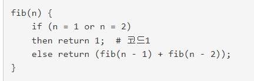
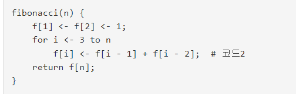
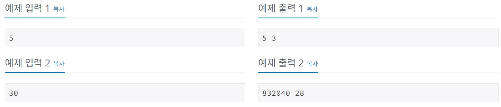

# 알고리즘_수업-피보나치_수_1
[문제링크](https://www.acmicpc.net/problem/24416)

## 1. 문제 설명

### 1.1 문제요약
- 오늘도 서준이는 동적 프로그래밍 수업 조교를 하고 있다. 아빠가 수업한 내용을 학생들이 잘 이해했는지 문제를 통해서 확인해보자.

- 오늘은 n의 피보나치 수를 재귀호출과 동적 프로그래밍으로 구하는 알고리즘을 배웠다. 재귀호출에 비해 동적 프로그래밍이 얼마나 빠른지 확인해 보자. 아래 의사 코드를 이용하여 n의 피보나치 수를 구할 경우 코드1 코드2 실행 횟수를 출력하자.

- 피보나치 수 재귀호출 의사 코드는 다음과 같다.

- 피보나치 수 동적 프로그래밍 의사 코드는 다음과 같다.

### 1.2 입출력 방식 
- 첫째 줄에 n(5 ≤ n ≤ 40)이 주어진다.
- 코드1 코드2 실행 횟수를 한 줄에 출력한다.

### 1.3 입출력 예시

## 2. 문제해결 아이디어

### 2.1 재귀함수 식과 dp 식을 파이썬 문법에 맞게 고쳐준다.

### 2.2 cnt1, cnt2 변수로 각 함수가 돌 때마다 카운트 해준다.
- 단 재귀함수를 카운트 할 때는 카운트 한 것에다가 +1을 해야한다.
