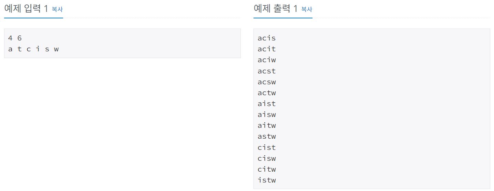

# 암호 만들기
[문제링크](https://www.acmicpc.net/problem/1759)

## 1. 문제 설명

### 1.1 문제요약
- 바로 어제 최백준 조교가 방 열쇠를 주머니에 넣은 채 깜빡하고 서울로 가 버리는 황당한 상황에 직면한 조교들은, 702호에 새로운 보안 시스템을 설치하기로 하였다. 이 보안 시스템은 열쇠가 아닌 암호로 동작하게 되어 있는 시스템이다.

- 암호는 서로 다른 L개의 알파벳 소문자들로 구성되며 최소 한 개의 모음(a, e, i, o, u)과 최소 두 개의 자음으로 구성되어 있다고 알려져 있다. 또한 정렬된 문자열을 선호하는 조교들의 성향으로 미루어 보아 암호를 이루는 알파벳이 암호에서 증가하는 순서로 배열되었을 것이라고 추측된다. 즉, abc는 가능성이 있는 암호이지만 bac는 그렇지 않다.

- 새 보안 시스템에서 조교들이 암호로 사용했을 법한 문자의 종류는 C가지가 있다고 한다. 이 알파벳을 입수한 민식, 영식 형제는 조교들의 방에 침투하기 위해 암호를 추측해 보려고 한다. C개의 문자들이 모두 주어졌을 때, 가능성 있는 암호들을 모두 구하는 프로그램을 작성하시오.

### 1.2 입출력 방식 
- 첫째 줄에 두 정수 L, C가 주어진다. (3 ≤ L ≤ C ≤ 15) 다음 줄에는 C개의 문자들이 공백으로 구분되어 주어진다. 주어지는 문자들은 알파벳 소문자이며, 중복되는 것은 없다.
- 각 줄에 하나씩, 사전식으로 가능성 있는 암호를 모두 출력한다.
### 1.3 입출력 예시

## 2. 문제해결 아이디어

### 2.1 무조건 오름차순으로 정렬하는 것을 토대로 규칙을 찾아본다.
- 일단 주어진 알파벳을 정렬한다.
- 순서가 이미 정해져있으므로, 순열을 사용하는것이 아니라 주어진 알파벳으로 가능한 조합만 다 구해주면 된다.

### 2.2 최소 한 개의모음(a,e,i,o,u)과 최소 두 개의 자음을 포함하는지 검사한다.
- 모음의 개수, 자음의 개수를 각각 세어준다.

### 2.3 결과를 출력한다.
- 가능한 조합들 중에 조건을 만족하는 것만 프린트한다.