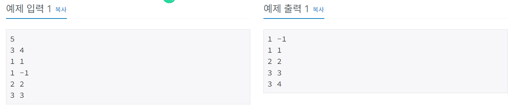

# 좌표 정렬하기
[문제링크](https://www.acmicpc.net/problem/11650)

## 1. 문제 설명

### 1.1 문제요약
- 2차원 평면 위의 점 N개가 주어진다. 좌표를 x좌표가 증가하는 순으로, x좌표가 같으면 y좌표가 증가하는 순서로 정렬한 다음 출력하는 프로그램을 작성하시오.

### 1.2 입출력 방식 
- 첫째 줄에 점의 개수 N (1 ≤ N ≤ 100,000)이 주어진다. 둘째 줄부터 N개의 줄에는 i번점의 위치 xi와 yi가 주어진다. (-100,000 ≤ xi, yi ≤ 100,000) 좌표는 항상 정수이고, 위치가 같은 두 점은 없다.
- 첫째 줄부터 N개의 줄에 점을 정렬한 결과를 출력한다.

### 1.3 입출력 예시

## 2. 문제해결 아이디어

### 2.1 x를 기준으로 먼저 정렬, 그다음 y를 기준으로 정렬해야한다.
- x,y를 한꺼번에 리스트로 받아준다.
- lambda를 이용해서 키 값으로 x,y를 둘다 주고 정렬한다.

### 2.2 정렬된 값을 하나씩 꺼내서 프린트한다.
