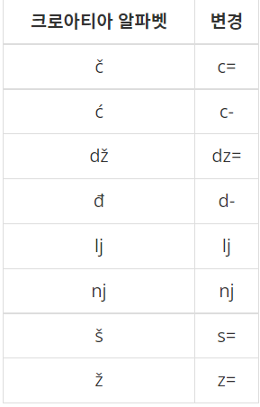
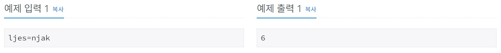
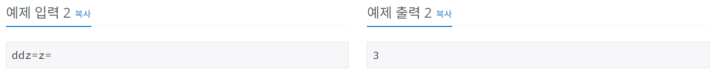

# 크로아티아 알파벳
[문제링크](https://www.acmicpc.net/problem/2941)

## 1. 문제 설명

### 1.1 문제요약
- 예전에는 운영체제에서 크로아티아 알파벳을 입력할 수가 없었다. 따라서, 다음과 같이 크로아티아 알파벳을 변경해서 입력했다.

- 예를 들어, ljes=njak은 크로아티아 알파벳 6개(lj, e, š, nj, a, k)로 이루어져 있다. 단어가 주어졌을 때, 몇 개의 크로아티아 알파벳으로 이루어져 있는지 출력한다.
- dž는 무조건 하나의 알파벳으로 쓰이고, d와 ž가 분리된 것으로 보지 않는다. lj와 nj도 마찬가지이다. 위 목록에 없는 알파벳은 한 글자씩 센다.

### 1.2 입출력 방식 
- 첫째 줄에 최대 100글자의 단어가 주어진다. 알파벳 소문자와 '-', '='로만 이루어져 있다.

- 단어는 크로아티아 알파벳으로 이루어져 있다. 문제 설명의 표에 나와있는 알파벳은 변경된 형태로 입력된다.
### 1.3 입출력 예시

## 2. 문제해결 아이디어

### 2.1 특수한 문자들은 무조건 붙어서 나온다. 붙어서 나올때는 항상 그 특수한 문자로만 취급한다는 점을 이용한다.
- 붙어서 나올 수 밖에 없는 부분들에 포커스해서, 그 부분들만 공백으로 바꿔준다.
- 붙어 나오지 않는 케이스는 그냥 놔둔다.
- 위의 두 과정을 진행하고 나서 len(S)를 적용하면 붙어나오는 특수한 문자는 공백으로 치환되어 1의 길이를, 붙어 나오지 않는 애들은 하나씩 세게 된다.
- len(S)가 곧 알파벳의 개수가 된다.