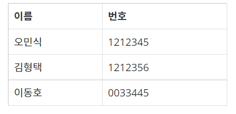
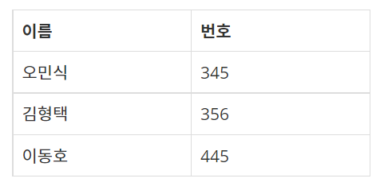
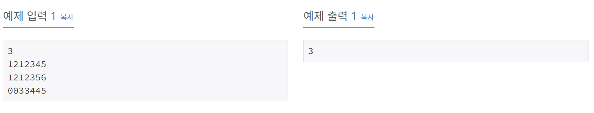

# 학생번호
[문제링크](https://www.acmicpc.net/problem/1235)

## 1. 문제 설명

### 1.1 문제요약
- 이번에는 학생들을 더욱 효율적으로 관리하기 위해 학생마다 고유한 학생 번호를 부여하기로 하였다. 학생 번호는 0부터 9 사이의 숫자로 이루어진 문자열로, 모든 학생들의 학생 번호는 서로 다르지만 그 길이는 모두 같다.

- 학생들의 번호를 부여해 놓고 보니, 김진영 조교는 어쩌면 번호가 지나치게 긴 것은 아닌가 싶은 생각이 들었다. 예를 들어 아래와 같은 7자리의 학생 번호를 보자.

- 이처럼 학생 번호를 굳이 7자리로 하지 않고, 뒤에서 세 자리만을 추려서 남겨 놓아도 모든 학생들의 학생 번호를 서로 다르게 만들 수 있다.

- 하지만 세 자리보다 적게 남겨 놓아서는 모든 학생들의 학생 번호를 서로 다르게 만들 수 없다.

- 학생들의 번호가 주어 졌을 때, 뒤에서 k자리만을 추려서 남겨 놓았을 때 모든 학생들의 학생 번호를 서로 다르게 만들 수 있는 최소의 k를 구하는 프로그램을 작성하시오.

### 1.2 입출력 방식 
1. 입력
- 첫째 줄에는 학생의 수 N(2≤N≤1,000)이 주어진다. 둘째 줄부터 N개의 줄에 걸쳐 각 학생의 학생 번호가 순서대로 주어진다. 모든 학생들의 학생 번호는 서로 다르지만 그 길이는 모두 같으며, 0부터 9 사이의 숫자로 이루어진 문자열이 주어진다. 문자열의 길이는 100보다 작거나 같다.

2. 출력
- 첫째 줄에 구하고자 하는 가장 작은 k값을 출력한다.

### 1.3 입출력 예시

## 2. 문제해결 아이디어

### 2.1 k를 1에서부터 늘려가면서 학생번호를 뒤에서부터 k자리만큼 잘라서 학생번호가 중복되지 않을 때까지 비교한다.
- 학생들의 학생번호를 뒤에서부터 k자리만큼자른다. (처음에 한자리만 비교하는 것부터 시작하므로 k는 1부터 시작한다.)
- k자리만큼 자른 학생번호들을 set에 넣어서 겹치는 것이 있는지 확인한다.
- 겹치는게 없어질때까지(위에서 적용시킨 set의 길이가 학생수와 같아야한다.) k를 1씩 증가시키면서 반복문을 계속한다.
- 겹치는게 없어지면 그때의 k를 출력한다. 