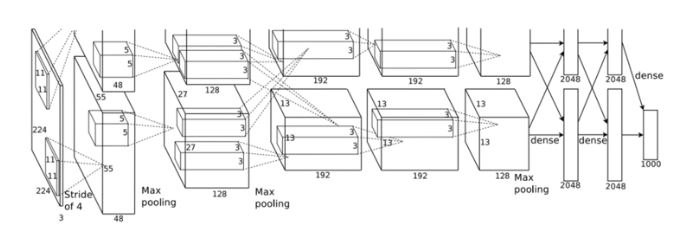

# AlexNet

LeNet과 비교해 최근에 발표되었다. LeNet과 유사하지만 다른 점이 존재한다.

구조

## 활성화 함수

ReLU를 이용한다.

## LeNET과의 차이점

 1) 활성화 함수로 ReLU를 이용한다.
 2) LRN(local response normalization)이라는 국소적 정규화를 실시하는 계층을 이용한다.
 3) 드롭아웃을 이용한다.