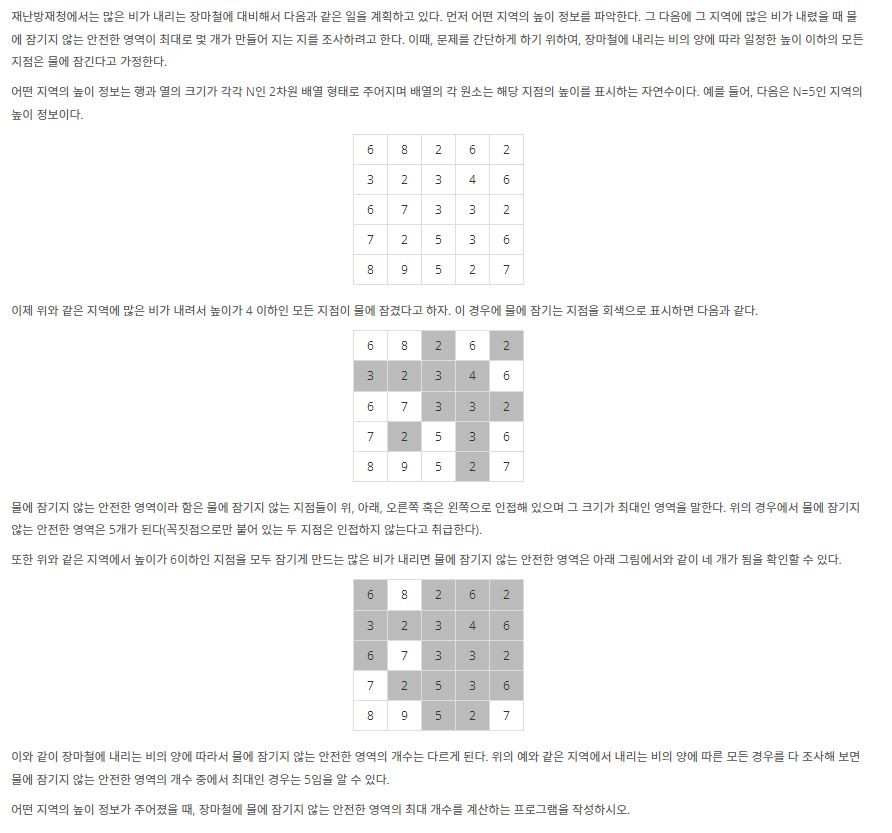

# [BOJ] 안전 영역

> 백준 연습문제

[문제링크](https://www.acmicpc.net/problem/2468)

## 1. 문제 설명
- 

### 1.1 문제요약

1. N * N 크기의 땅에 각 땅 마다 높이가 주워진다.
2. 비가 많이 와서 낮은곳 부터 침수되며 침수되지 않은 영역을 안전영역이라 칭한다.
3. 비가 와서 해수면의 높이가 점차 높아짐에 따라 안전 영역의 숫자는 바뀔 것이다. 이 때 안전영역의 최대 갯수를 구하라.

### 1.2 입출력 예시

- 입력
  첫째 줄에는 어떤 지역을 나타내는 2차원 배열의 행과 열의 개수를 나타내는 수 N이 입력된다. N은 2 이상 100 이하의 정수이다. 둘째 줄부터 N개의 각 줄에는 2차원 배열의 첫 번째 행부터 N번째 행까지 순서대로 한 행씩 높이 정보가 입력된다. 각 줄에는 각 행의 첫 번째 열부터 N번째 열까지 N개의 높이 정보를 나타내는 자연수가 빈 칸을 사이에 두고 입력된다. 높이는 1이상 100 이하의 정수이다.

  
- 출력
  첫째 줄에 장마철에 물에 잠기지 않는 안전한 영역의 최대 개수를 출력한다.

## 2. 문제해결 아이디어
- BFS를 활용한다.
  - DFS의 경우 메모리 초과 발생.
- 물의 높이는 for문을 사용하여 점차 높아짐을 적용할 수 있다.