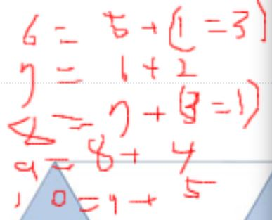
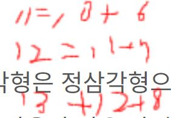
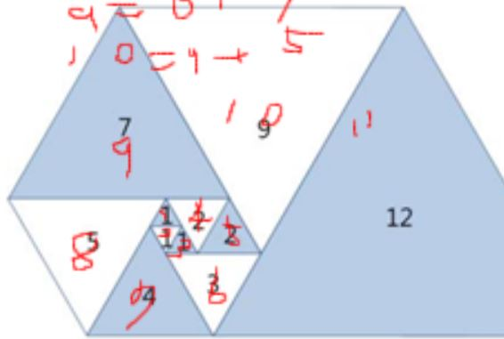

# [PGS] 파도반 수열

> 프로그래머스 연습문제

[문제링크](https://www.acmicpc.net/problem/9461)

## 1. 문제 설명
- 오른쪽 그림과 같이 삼각형이 나선 모양으로 놓여져 있다. 첫 삼각형은 정삼각형으로 변의 길이는 1이다. 그 다음에는 다음과 같은 과정으로 정삼각형을 계속 추가한다. 나선에서 가장 긴 변의 길이를 k라 했을 때, 그 변에 길이가 k인 정삼각형을 추가한다.

파도반 수열 P(N)은 나선에 있는 정삼각형의 변의 길이이다. P(1)부터 P(10)까지 첫 10개 숫자는 1, 1, 1, 2, 2, 3, 4, 5, 7, 9이다.

N이 주어졌을 때, P(N)을 구하는 프로그램을 작성하시오.

### 1.1 문제요약

1. 한 변의 길이가 점차 증가하는 삼각형의 한 변의 길이를 구하라.

### 1.2 입출력 예시

- 입력
- 첫째 줄에 테스트 케이스의 개수 T가 주어진다. 각 테스트 케이스는 한 줄로 이루어져 있고, N이 주어진다. (1 ≤ N ≤ 100)

- 출력
- 각 테스트 케이스마다 P(N)을 출력한다.
- 

## 2. 문제해결 아이디어
- 점화식을 정의한다.
- 1~3번 째의 값이 동일, 4~5번 째 값이 동일 함을 인지한다.

### 1) 문제의 핵심

