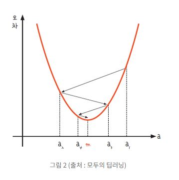
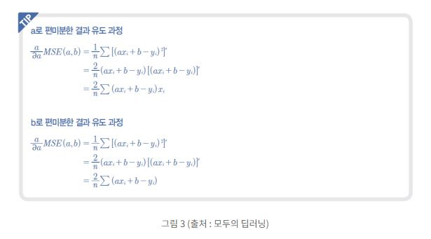
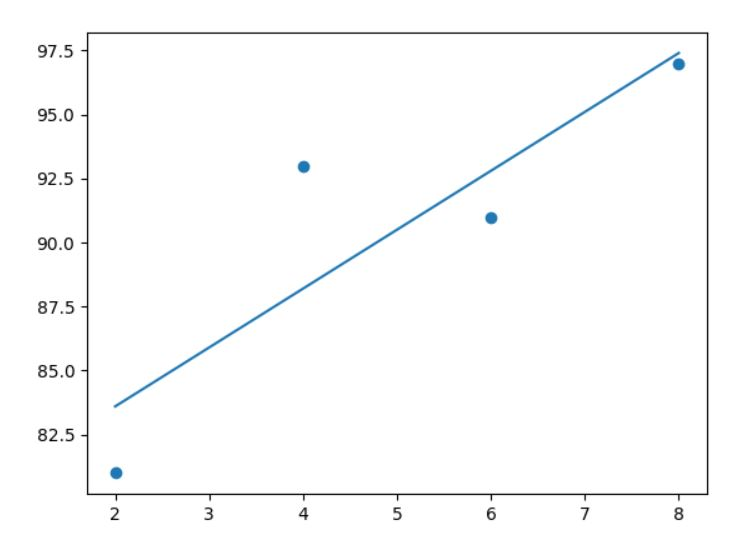
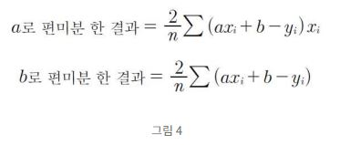
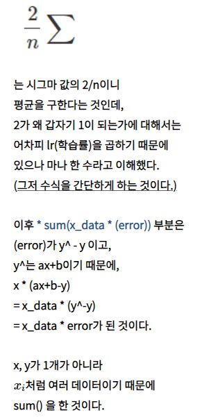

# 1. 경사하강법 (Gradient Descent)

## 1) 경사하강법이란?

 
 
 값(미분값, 기울기)가 작아지는 방향으로 경사를 하강시키며 m 지점(기울기 0)을 찾는다.

## 2) 학습률

 m지점을 찾아가는데 얼마 만큼 이동할지를 결정하는 값이다.
최적의 값은 존재하지 않고 적절한 값을 찾기 위해 여러번 시도해야한다.

## 3) 코드 구현

 
 
최종결과

 * 이해가 어려웠던 부분 해설

출처 : https://likethefirst.tistory.com/entry/Python-%EA%B2%BD%EC%82%AC-%ED%95%98%EA%B0%95%EB%B2%95-%EC%BD%94%EB%94%A9%EC%9C%BC%EB%A1%9C-%ED%99%95%EC%9D%B8%ED%95%98%EA%B8%B0