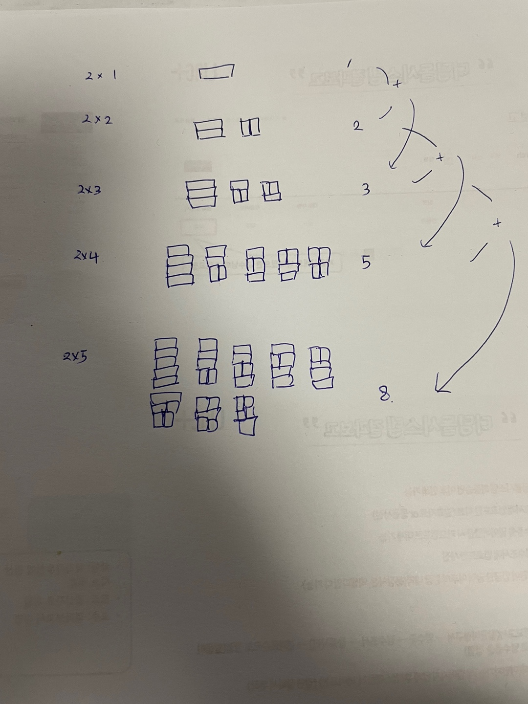

# [BOJ] 2xn 타일링 (Silver-3)

[문제링크](https://www.acmicpc.net/problem/11726)

## 1. 문제 설명


### 1.1 문제요약

1. 2 x n 크기의 직사각형을 1x2, 2x1 타일로 채우는 방법의 수를 구하라.
2. n은 첫째 줄에 주어지며 1<= n <= 1000의 조건을 만족한다.

### 1.2 입출력 예시

- 입력

  ```python
  2
  9
  ```
  
- 출력

  ```python
  2
  55
  ```
  
  

## 2. 문제해결 아이디어


### 1) 문제의 핵심


#### (1) Dynamic Programming

- 본 문제는 시간제한이 있는 문제로 다이나믹 프로그래밍을 통해 효율적으로 계산한다.


#### (2) 타일의 규칙



- 다음과 같이 타일은 N[n] = N[n - 1] + N[n - 2] (단, n >= 2)의 규칙을 가진다.

