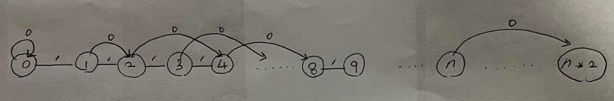

# [BOJ] 숨바꼭질 3 (Gold 5)

> .

[문제링크](https://www.acmicpc.net/problem/13549)

## 1. 문제 설명


### 1.1 문제요약

1. 수빈이와 동생이 숨바꼭질을 하고있다.
2. 수빈이는 점 N (0 <= N <= 100,000)에 위치하고, 동생은 점 K (0 <= K <= 100,000)에 위치한다.
3. 수빈이는 걷거나 순간이동을 통해서 이동할 수 있다.
   - 수빈이가 X 위치에서 걷는다면 1초 후에 X-1, X+1로 이동하게된다.
   - 수빈이가 X 위치에서 순간이동을 한다면 0초 후에 X * 2로 이동하게된다.
4. 수빈이와 동생의 위치가 주어졌을 때, 수빈이가 동생을 찾을 수 있는 가장 빠른 시간이 몇 초 후인지 구하는 프로그램을 작성하시오.

### 1.2 입출력 예시

- 입력

  ```python
  5 17
  ```
  
- 출력

  ```python
  2
  ```
  
  

## 2. 문제해결 아이디어


### 1) 문제의 핵심


#### (1) Dijkstra 알고리즘에 대한 지식

- Dijkstra는 하나의 정점에서 다른 모든 정점으로의 거리를 구하는 알고리즘이다. 이 알고리즘은 하나의 정점에서 다른 정점으로 갈때, 특정 정점을 거쳐서 갈 수 있기 때문에 여러가지 Sub task로 쪼갤 수 있다는 점에서 Dynamic programming으로 볼 수 있다.
- [Reference]
  - [Youtube - 동빈나](https://www.youtube.com/watch?v=611B-9zk2o4)
  - [Youtube - 한빛미디어](https://www.youtube.com/watch?v=F-tkqjUiik0)


#### (2) 최소 힙에 대한 지식

- Dijkstra 알고리즘을 사용할 때, 단순 반복문을 이용하여서 최소거리를 구하게 되면 시간 복잡도가 O(n ** 2)으로 매우 커진다. (이유는 최소거리를 구할 때 정렬하는 과정에서 시간이 많이 걸린다.)
- 따라서 정렬의 시간 복잡도가 O(n * log n)인 최소 힙을 사용하여 시간 복잡도를 최소화해야한다.
- python의 경우 ``heapq`` 라이브러리를 이용한다. (최소힙으로 구현되어있음.)


#### (3) 주어진 문제를 그래프화하여 해석

- 주어진 문제는 1차원 선에서 두 점 간의 최소거리를 구하는 문제이다. 하지만 순간이동이라는 특정한 조건이 있기 때문에 해당 문제를 그래프로 표현하면 다음과 같다.

  

- 즉, 순간이동으로 연결된 노드는 비용이 0이고 n -> n * 2의 방향선을 가진 간선으로 연결되어있다.

- 또한, 걷기로 연결된 노드는 n - n + 1 간의 양방향을 가지고, 비용이 1인 간선으로 연결되어있다.

- 위와 같이 해당 문제를 그래프화 하였다면 다익스트라 알고리즘을 통해서 N점에서 K점까지의 최소거리를 구하면 된다.