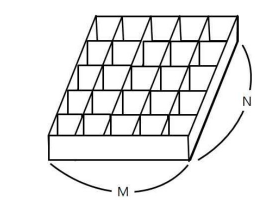

# [BOJ] 토마토 (Gold-5)

> [Olympiad](https://www.acmicpc.net/category/2) > [한국정보올림피아드](https://www.acmicpc.net/category/55) > [한국정보올림피아드시․도지역본선](https://www.acmicpc.net/category/57) > [지역본선 2013](https://www.acmicpc.net/category/214) > [고등부](https://www.acmicpc.net/category/detail/910) 1번

[문제링크](https://www.acmicpc.net/problem/7576)

## 1. 문제 설명


### 1.1 문제요약

1. N x M 크기의 토마토 박스가 주어진다.
2. 해당 토마토 박스에는 익은 토마토(1), 익지않은 토마토(0), 빈 공간(-1)로 표현이 된다.
3. 익은 토마토와 상, 하, 좌, 우로 붙어있는 익지않은 토마토는 하루가 지나면 익은 토마토의 영향을 받아 익게된다.
4. 토마토 박스안의 토마토들이 최소 몇일이 지나야 모두 익는지에 대한 최소 일수를 출력하라. 만약, 모두 익을 수 없다면 -1을 출력하라.



### 1.2 입출력 예시

- 입력

  ```python
  6 4
  0 0 0 0 0 0
  0 0 0 0 0 0
  0 0 0 0 0 0
  0 0 0 0 0 1
  
  6 4
  1 -1 0 0 0 0
  0 -1 0 0 0 0
  0 0 0 0 -1 0
  0 0 0 0 -1 1
  
  5 5
  -1 1 0 0 0
  0 -1 -1 -1 0
  0 -1 -1 -1 0
  0 -1 -1 -1 0
  0 0 0 0 0
  
  6 4
  0 -1 0 0 0 0
  -1 0 0 0 0 0
  0 0 0 0 0 0
  0 0 0 0 0 1
  ```
  
- 출력

  ```python
  8
  
  6
  
  14
  
  -1
  ```
  
  

## 2. 문제해결 아이디어


### 1) 문제의 핵심


#### (1) 그래프 탐색 알고리즘의 응용

- 해당 문제는 시작점이 여러 개이다. 따라서 한 사이클에 그 당시 탐색할 수 있는 모든 시작점을 탐색하고, 그 다음 사이클에 또 그 시점에서 탐색할 수 있는 모든 시작점을 탐색하는 방식이다.
- BFS의 알고리즘을 부분적으로 사용하여 모든 노드를 탐색하는 것이 아니라 부분적으로 탐색하는 것이 필요하다.
- 해당 문제는 deque를 사용하여 BFS를 구현하였다.


#### (2) 시간초과

- 필자는 탐색후 새로운 시작점을 추가하는 과정에서 중복좌표를 제거하기 위해 set을 사용했으나, 시간초과가 발생하여 해당 부분은 제거하였다. set을 사용하는 것보다 중복좌표를 한번 더 사용하는 것이 시간이 더 적게 걸렸다.