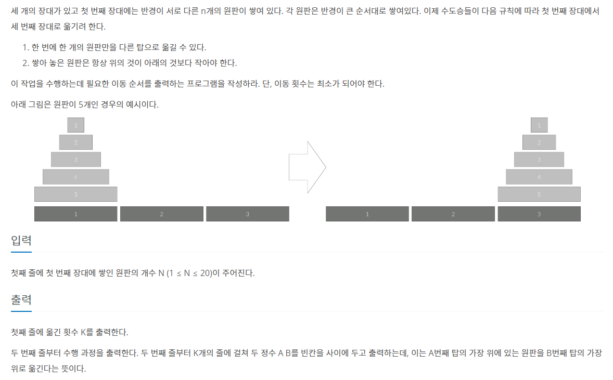

# [BOJ] 하노이 탑 이동 순서 (Silver-1)

[문제링크](https://www.acmicpc.net/problem/11729)

## 1. 문제 설명


### 1.1 문제요약



### 1.2 입출력 예시

- 입력

  ```python
  3
  ```
  
- 출력

  ```python
  7
  1 3
  1 2
  3 2
  1 3
  2 1
  2 3
  1 3
  ```
  
  

## 2. 문제해결 아이디어


### 1) 문제의 핵심


#### (1) 재귀함수

- 하노이 탑 문제는 재귀함수로 해결할 수 있다.


#### (2) 하노이 탑의 원판을 최소로 옮기는 원리

- 코드 주석 참고