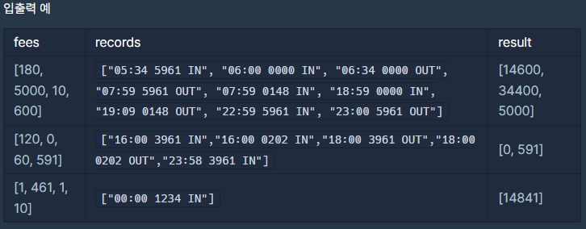

# [PGS] 주차 요금 계산(Level - 2)

> 2022 KAKAO BLIND RECRUITMENT

[문제링크](https://school.programmers.co.kr/learn/courses/30/lessons/92341)

## 1. 문제 설명

### 1.1 문제요약

1. 주차 요금에 대한 정보와 (출차, 입차)에 대한 정보가 배열의 형태로 주어진다.
2. 다음의 두 정보로 차량의 하루동안 누적 주차 시간에 대한 요금을 계산하여, 차량번호가 작은순으로 반환하라. (return 형태는 [차량1요금, 차량2요금, 차량3요금] 이다.)
3. 단, 입차와 출차의 집계는 00:00 ~ 23:59까지로 하며, 마지막 출차 정보가 없는 차량은 23:59에 출차한 것으로 간주한다.
4. 또한 초과한 시간이 단위 시간으로 나누어 떨어지지 않으면 올림한다.

### 1.2 입출력 예시

## 2. 문제해결 아이디어

### 1) 문제의 핵심

#### (1) 차량에 대한 정보 관리

- 이번 문제의 핵심은 각 차량에 대한 개별적인 정보를 잘 관리하는데 있다. 필자는 해당 정보를 dict() 자료형으로 관리하였다.

  (class로 관리한 풀이가 있는데, 이게 모범 정답인 것 같다.)

- 차량의 입차와 출차에 대한 정보의 관리, 또한 마지막 출차 기록이 없는 차량에 대한 처리가 중요하다.